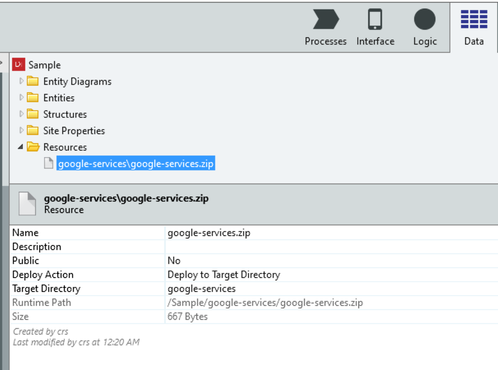

# Georef Plugin
- [Georef Plugin](#georef-plugin)
  - [Configuring plugin in Outsystems](#configuring-plugin-in-outsystems)
    - [iOS Plist file](#ios-plist-file)
  - [Debug Release Builds](#debug-release-builds)
    - [Android](#android)
    - [iOS](#ios)
  - [Creating Sample Cordova Application](#creating-sample-cordova-application)

## Configuring plugin in Outsystems
On the plugin module, open Extensibility Configuration property and use the following JSON structure:

```json
{
    "plugin": {
        "url": "<REPO_URL>",
        "variables":
            [
                {
                    "name": "GMAPS_API_KEY",
                    "value": "<YOUR_MAPS_KEY>"
                },
                {
                    "name": "LOCATION_WHEN_USAGE_DESCRIPTION",
                    "value": "<DESCRIPTION FOR IOS PERMISSION POP UP>"
                }
            ]
    }
}
```
For more info, check the [official documentation](https://success.outsystems.com/Documentation/10/Extensibility_and_Integration/Mobile_Plugins/Using_Cordova_Plugins).

### iOS Plist file
For google services to work correctly, in iOS, we need to add a Google-Services.plist file to the resources of the application. Here are the steps:

1. You can obtain your `GoogleService-Info.plist` file in the firebase console.
1. You should add this file to a zip file with the name google-services and add that zip file to the Resources of the Outsystems application.
1. Set the **Deploy Action **to **Deploy to Target Directory** and set the target directory as `google-services`



For more information on how to obtain the plist file, [see this plugin](https://www.outsystems.com/forums/discussion/31931/firebase-cloud-message-plugin-documentation/) configuration, which has a similar approach.
## Debug Release Builds

The Georef SDK contains distinct binaries for development or production builds, for both Android and iOS platforms.

### Android
To use the production binaries for android simply do a build of type Release. Otherwise, the development binaries are used.

### iOS
To use the production binaries for iOS there must be a preference set in the config.xml of the cordova application:

```xml
<preference name="ENVIRONMENT" value="prd">
```

If the preference is not set, the default development binaries are used.

In the Outsytstems platform this preference can be set in the Extensibility configuration of the application. 

* [Override the Default Mobile Extensibility Configurations](https://success.outsystems.com/Documentation/11/Managing_the_Applications_Lifecycle/Deploy_Applications/Override_the_Default_Mobile_Extensibility_Configurations)


## Creating Sample Cordova Application

1. Create cordova application
    ```bash
    cordova create sampleApp;
    cd sampleApp;
    //MABS 5
    cordova platform add android@8.0.0;
    cordova platform add ios@4.5.5;
    cordova plugin add ../GeorefPlugin
 
    ```
2. Add Georef Plugin
    ```bash
    cordova plugin add <LOCAL_PATH_TO_REPO | REPO_GIT_URL> --variable GMAPS_API_KEY='<YOUR_MAPS_KEY>' --variable LOCATION_WHEN_USAGE_DESCRIPTION='<DESCRIPTION FOR IOS PERMISSION POP UP>'
    ```
    Both variables are optional, having their default values declared in the [plugin.xml](/plugin.xml).
3. Ready!